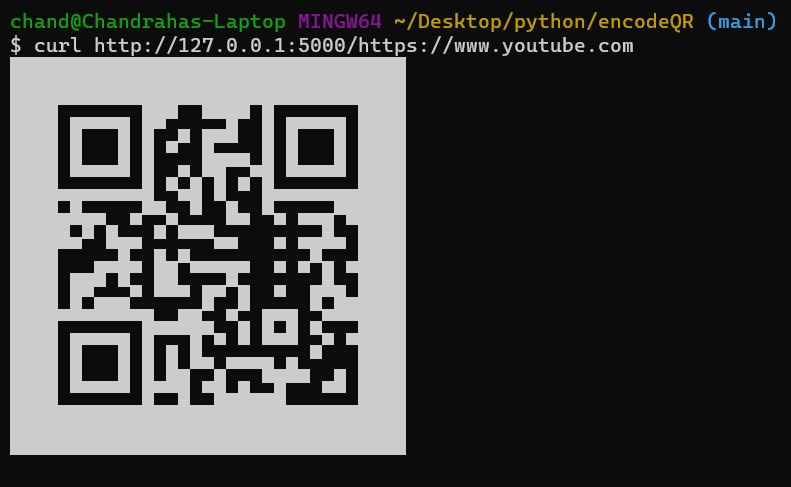
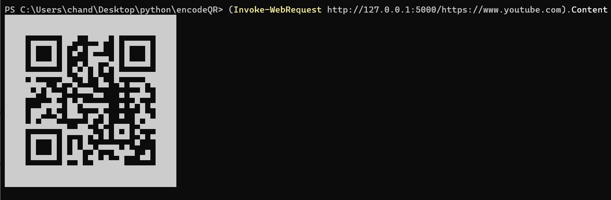
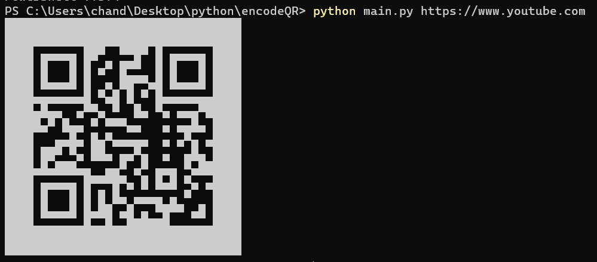

# Usage

## app.py
start the flask/wsgi server,  
then send requests using `curl` or `Invoke-WebRequest`. (Note: using `curl.exe` on windows is not recomended)
```
$ curl http://[server address]/[text or url]
```
```
> (Invoke-WebRequest http://[server address]/[text or url]).Content
 or
> (iwr http://[server address]/[text or url]).Content
```
### Examples:




## main.py
```
python main.py [text or url]
```
### Example:

